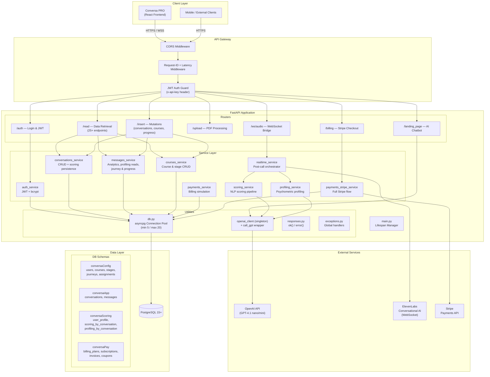

# Conversa API — Backend

<div align="center">
  
  
  
  
  
  
  
</div>

<br/>

**Conversa API** is the production-grade backend for the **Conversa** conversation-training platform. It provides real-time voice-to-voice AI coaching, automated NLP-based scoring, psychometric profiling, and a full course management system — all built on an async-first FastAPI architecture designed for hundreds of concurrent users.

---

## Table of Contents

1. [Architecture Overview](#architecture-overview)
2. [Tech Stack](#tech-stack)
3. [Project Structure](#project-structure)
4. [Getting Started](#getting-started)
5. [Environment Variables](#environment-variables)
6. [Running the Server](#running-the-server)
7. [API Endpoint Reference](#api-endpoint-reference)
8. [Database Schemas](#database-schemas)
9. [Key Design Decisions](#key-design-decisions)
10. [Testing & Simulation](#testing--simulation)
11. [Contributing](#contributing)

---

## Architecture Overview



---

## Tech Stack

| Component | Technology |
|-----------|-----------|
| Language | Python 3.10+ |
| Framework | FastAPI (fully async) |
| Database | PostgreSQL 15+ |
| DB Driver | **asyncpg** — async connection pooling (configurable min/max) |
| Auth | JWT via python-jose + bcrypt password hashing |
| AI / Scoring | OpenAI GPT-4.1 (nano & mini models) |
| Voice AI | ElevenLabs Conversational AI (bidirectional WebSocket) |
| Payments | Stripe API (subscriptions, one-time fees, coupons) |
| Validation | Pydantic v2 + pydantic-settings |
| Package Mgr | Poetry |
| Formatting | Black + isort |
| Type Checking | mypy |

---

## Project Structure

```
Back-End-LLM/
├── app/
│   ├── main.py                  # FastAPI app factory, middleware, lifespan
│   ├── config.py                # Centralised settings (pydantic-settings, validated at boot)
│   ├── __init__.py
│   │
│   ├── routers/                 # HTTP & WebSocket endpoint handlers
│   │   ├── auth.py              #   POST /auth/login
│   │   ├── read.py              #   GET  /read/*  (25+ data retrieval endpoints)
│   │   ├── insert.py            #   POST /insert/* (conversations, messages, courses, stages)
│   │   ├── upload.py            #   POST /upload/pdf, /upload/summarize
│   │   ├── payments.py          #   POST /billing/checkout
│   │   ├── realtime_router.py   #   WS   /ws/audio  (ElevenLabs bridge)
│   │   └── landing_page_assistant.py  # GET /landing_page/landing-assistant
│   │
│   ├── schemas/                 # Pydantic request / response models
│   │   ├── auth.py              #   LoginRequest, UserResponse, LoginResponse
│   │   ├── insert.py            #   Conversation, Message, Course, Stage schemas
│   │   └── read.py              #   CourseResponse, ConversationResponse, etc.
│   │
│   ├── services/                # Business logic & data access layer
│   │   ├── db.py                #   asyncpg pool lifecycle + execute helpers
│   │   ├── auth_service.py      #   Credential validation, JWT creation/verification
│   │   ├── conversations_service.py  # Conversation CRUD + scoring/profiling persistence
│   │   ├── messages_service.py  #   Message CRUD, analytics, journey, progress, KPIs
│   │   ├── courses_service.py   #   Course & stage CRUD
│   │   ├── scoring_service.py   #   Per-conversation NLP scoring pipeline
│   │   ├── profiling_service.py #   Per-conversation + general psychometric profiling
│   │   ├── realtime_service.py  #   End-of-call pipeline orchestrator
│   │   ├── prompting_service.py #   Dynamic prompt generation from course data
│   │   ├── payments_service.py  #   Billing plans, coupon validation, pricing simulation
│   │   ├── payments_stripe_service.py  # Full Stripe checkout orchestration
│   │   ├── landing_page_assistant.py   # OpenAI-powered landing chatbot
│   │   ├── upload.py            #   PDF extraction & chunk summarisation
│   │   └── realtime_bridge_elevenlabs.py  # Bidirectional ElevenLabs WS bridge
│   │
│   ├── utils/                   # Shared utilities
│   │   ├── call_gpt.py          #   OpenAI responses API wrapper
│   │   ├── openai_client.py     #   Singleton OpenAI client (lru_cache)
│   │   ├── responses.py         #   Standardised ok() / error() helpers
│   │   └── exceptions.py        #   Global exception handlers (HTTP, validation, 500)
│   │
│   └── prompting_templates/     # LLM prompt templates
│       ├── master_template.py   #   Master prompt builder
│       ├── scoring/             #   Per-dimension scoring prompts
│       ├── profiling/           #   Per-dimension profiling prompts + general feedback
│       └── landing/             #   Landing page assistant system prompt
│
├── scoring_scripts/             # Standalone scoring & classification logic
│   ├── get_conver_scores.py     #   Conversation-level metric extraction
│   ├── get_conver_skills.py     #   Soft-skill profiling extraction
│   └── get_user_profile.py      #   User persona classifier
│
├── scoring_notebooks/           # Jupyter notebooks for metric simulation
│   └── scoring_simulator.ipynb
│
├── pyproject.toml               # Poetry dependencies & tool config
├── poetry.lock                  # Locked dependency versions
└── .env                         # Environment variables (never committed)
```

---

## Getting Started

### Prerequisites

- Python 3.10 or later
- PostgreSQL 15+ with the `pgcrypto` extension enabled
- [Poetry](https://python-poetry.org/docs/#installation) package manager
- An OpenAI API key
- (Optional) ElevenLabs API key for voice features
- (Optional) Stripe secret key for payment features

### Installation

```bash
# 1. Clone the repository
git clone <repo-url>
cd Back-End-LLM

# 2. Install all dependencies (including dev tools)
poetry install

# 3. Copy the environment template and fill in your values
cp .env.example .env
# Then edit .env with your real credentials
```

---

## Environment Variables

| Variable | Required | Default | Description |
|----------|----------|---------|-------------|
| `ENVIRONMENT` | Yes | `DEV` | `DEV` or `PRO` — selects which database URL to use |
| `DATABASE_URL_DEV` | Yes (dev) | — | PostgreSQL connection string for development |
| `DATABASE_URL_PRO` | Yes (prod) | — | PostgreSQL connection string for production |
| `OPENAI_API_KEY` | Yes | — | OpenAI API key (scoring, profiling, chatbot) |
| `SECRET_KEY_JWT` | Yes | — | Secret used to sign/verify JWT tokens |
| `ELEVENLABS_AGENT_ID` | No | — | ElevenLabs Conversational AI agent ID |
| `ELEVENLABS_API_KEY` | No | — | ElevenLabs API key |
| `STRIPE_SECRET_KEY` | No | — | Stripe secret key for payment processing |
| `STRIPE_SETUP_FEE_PRICE_ID` | No | — | Stripe Price ID for one-time setup fees |
| `CORS_ORIGINS` | No | `*` | Comma-separated allowed origins |
| `DB_POOL_MIN` | No | `5` | Minimum connections in the asyncpg pool |
| `DB_POOL_MAX` | No | `20` | Maximum connections in the asyncpg pool |
| `DEBUG` | No | `false` | Enable debug-level logging |
| `RATE_LIMIT_PER_MINUTE` | No | `120` | Max requests per minute per IP |
| `JWT_EXPIRE_MINUTES` | No | `1440` | JWT token lifetime in minutes (default 24h) |

---

## Running the Server

### Development (with hot-reload)

```bash
poetry run uvicorn app.main:app --reload --host 0.0.0.0 --port 8000
```

### Production

```bash
poetry run uvicorn app.main:app --host 0.0.0.0 --port 8000 --workers 4
```

Interactive API documentation:

- **Swagger UI**: [http://localhost:8000/docs](http://localhost:8000/docs)
- **ReDoc**: [http://localhost:8000/redoc](http://localhost:8000/redoc)
- **Health check**: [http://localhost:8000/health](http://localhost:8000/health)

---

## API Endpoint Reference

### Authentication

| Method | Path | Auth | Description |
|--------|------|------|-------------|
| `POST` | `/auth/login` | No | Authenticate with email + password; returns JWT |

### Read (25+ data retrieval endpoints)

| Method | Path | Auth | Description |
|--------|------|------|-------------|
| `GET` | `/read/all_courses` | JWT | List all courses |
| `GET` | `/read/all_stages` | JWT | List all stages with content |
| `GET` | `/read/courses` | JWT | Courses assigned to a user |
| `GET` | `/read/courses_stages` | — | Stages within a course |
| `GET` | `/read/courses_details` | — | Full course + stage details |
| `GET` | `/read/company_courses` | — | Courses for a company |
| `GET` | `/read/conversation` | — | Single conversation + scoring |
| `GET` | `/read/conversations` | — | User's 10 most recent conversations |
| `GET` | `/read/messages` | JWT | Messages in a conversation |
| `GET` | `/read/userProfiling` | — | User profiling scores & feedback |
| `GET` | `/read/userProfilingGeneralFeedback` | — | Aggregated profiling feedback |
| `GET` | `/read/allUserScoreByCompany` | — | Company leaderboard (top 5) |
| `GET` | `/read/allUserConversationScoresByCompany` | — | Per-user scoring averages |
| `GET` | `/read/allUserConversationScoresByStageCompany` | — | Stage-level scoring |
| `GET` | `/read/allUserConversationAverageScoresByStageCompany` | — | Avg stage scoring |
| `GET` | `/read/userScoringTimeSeries` | — | Cumulative daily score |
| `GET` | `/read/allUserProfilingByCompany` | — | Profiling for all company users |
| `GET` | `/read/companyKPIdashboard` | — | Company KPI dashboard |
| `GET` | `/read/userJourney` | — | User journeys with progress |
| `GET` | `/read/user_course_progress` | — | Course progress for a user |
| `GET` | `/read/myAnalytics` | — | Individual dashboard stats |
| `GET` | `/read/myAnalytics-ScoringTab` | — | Scoring-tab metrics (4 parallel queries) |
| `GET` | `/read/myAnalytics-PersonalityTab` | — | Persona profile card |
| `GET` | `/read/plans` | — | Active billing plans |
| `GET` | `/read/check-coupon` | — | Validate a coupon code |
| `GET` | `/read/companies_news` | — | Company announcements |

### Insert (Mutations)

| Method | Path | Auth | Description |
|--------|------|------|-------------|
| `POST` | `/insert/conversation` | — | Start a new conversation |
| `POST` | `/insert/close_conversation` | — | Mark conversation as finished |
| `POST` | `/insert/message` | — | Persist a message |
| `POST` | `/insert/update_progress` | — | Update module progress (journey-aware) |
| `POST` | `/insert/update_user_course_progress` | — | Increment course progress |
| `POST` | `/insert/simulate-investment` | — | Preview checkout pricing |
| `POST` | `/insert/course` | JWT | Create a course (admin) |
| `POST` | `/insert/update_course` | JWT | Update a course (admin) |
| `POST` | `/insert/stage` | JWT | Create a stage (admin) |
| `POST` | `/insert/update_stage` | JWT | Update a stage (admin) |

### Upload / Billing / Landing / WebSocket / Health

| Method | Path | Description |
|--------|------|-------------|
| `POST` | `/upload/pdf` | Extract & summarise a PDF |
| `POST` | `/upload/summarize` | Summarise text chunks |
| `POST` | `/billing/checkout` | Full Stripe checkout flow |
| `GET` | `/landing_page/landing-assistant` | AI chatbot for landing visitors |
| `WSS` | `/ws/audio` | Real-time audio bridge (Frontend ↔ ElevenLabs) |
| `GET` | `/` | Root health check |
| `GET` | `/health` | Service health + version + environment |

---

## Database Schemas

The PostgreSQL database is organised into four schemas:

| Schema | Purpose |
|--------|---------|
| `conversaConfig` | Users, courses, stages, course contents, journeys, user assignments, company announcements |
| `conversaApp` | Conversations, messages |
| `conversaScoring` | User profiles, scoring by conversation, profiling by conversation, profile descriptions |
| `conversaPay` | Billing plans, subscriptions, invoices, coupons, payment transactions |

---

## Key Design Decisions

**Async-first with asyncpg.** Every database operation is non-blocking. The connection pool (configurable via `DB_POOL_MIN` / `DB_POOL_MAX`) is created once during the FastAPI lifespan hook and shared across all requests. This avoids the overhead of per-request connection creation and supports hundreds of concurrent users.

**Centralised configuration.** All environment variables are validated at boot time through `pydantic-settings`. A misconfigured deployment fails immediately with a descriptive error rather than crashing unpredictably at runtime.

**Singleton OpenAI client.** A single `OpenAI` instance is cached with `@lru_cache` and reused across the entire process, eliminating repeated HTTP transport initialisation on every scoring/profiling call.

**Structured error handling.** Three layers of exception handling work together: (1) service-level try/except with logging, (2) router-level `error()` helper that raises `HTTPException`, (3) global exception handlers that catch anything that slips through and return a consistent JSON envelope.

**Request-ID tracing.** Every HTTP response carries an `X-Request-ID` header. Server logs include the request ID, method, path, status code, and latency in milliseconds — making production debugging and log correlation straightforward.

**DRY service layer.** Repetitive query patterns (profiling reads, scoring persistence, progress updates) are consolidated into shared functions in the service layer. Schema objects use inheritance (`_StageFields`) to avoid field duplication between create and update models.

**Parallel query execution.** Analytics endpoints (e.g., `/myAnalytics-ScoringTab`) use `asyncio.gather()` to execute independent database queries concurrently, reducing response latency.

---

## Testing & Simulation

```bash
# Run unit tests
poetry run pytest -v

# Scoring simulation notebook
# Open scoring_notebooks/scoring_simulator.ipynb to simulate conversation
# transcripts and analyse metrics before deploying prompt changes.
```

---

## Contributing

1. Create a feature branch from `develop` (`git checkout -b feature/your-feature`).
2. Install dependencies: `poetry install`.
3. Format code: `poetry run black . && poetry run isort .`.
4. Run type checks: `poetry run mypy app/`.
5. Open a pull request against `develop` with a clear description.

---

## License

This project is proprietary and confidential. Unauthorized copying or distribution is strictly prohibited unless explicitly authorised.
